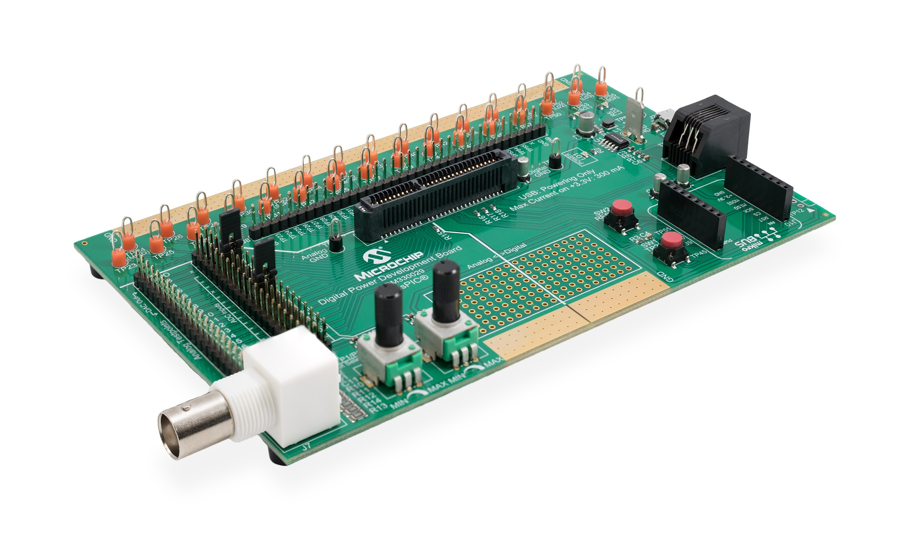
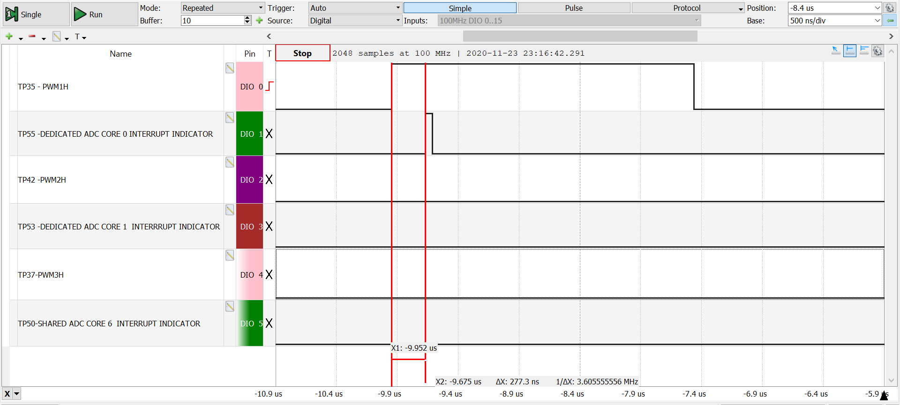
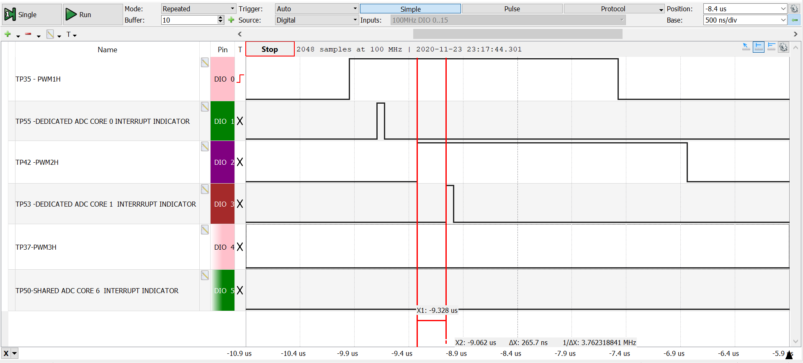
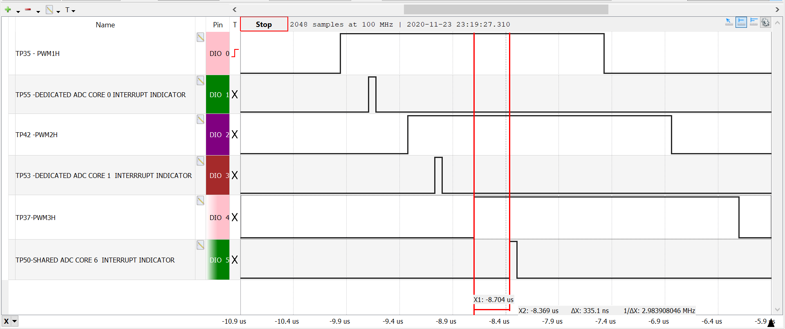
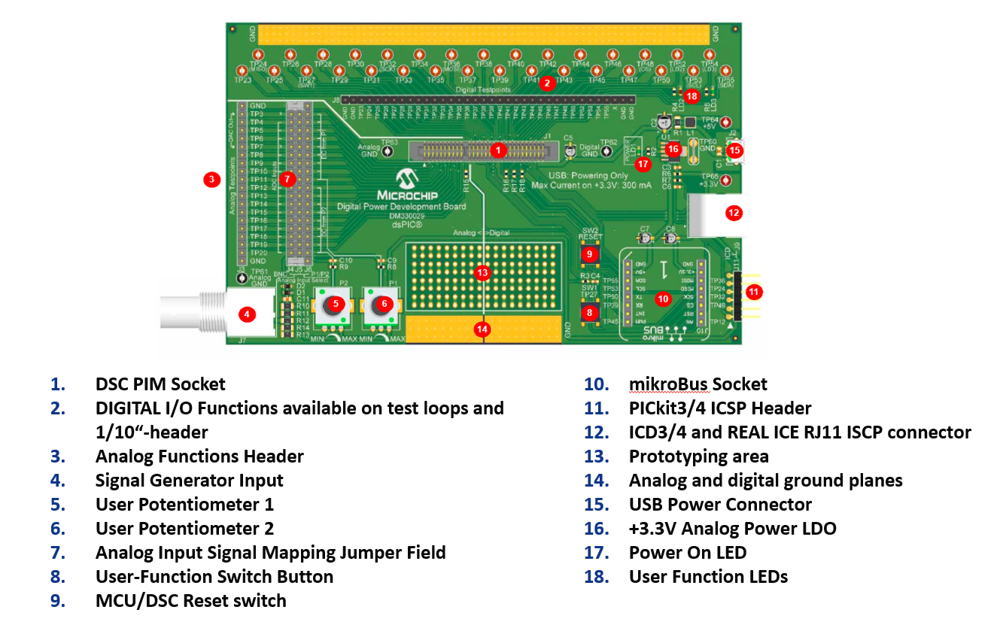

 <article class="markdown-body entry-content p-3 p-md-6" itemprop="This needs to be locked down and 'never' changed">
 

# dsPIC33C PWM/ADC Configuration: Lab 7 
**ADC Trigger using PWM Generator**

- - -

## Summary
Learning how to use the PWM and ADC of dsPIC33C MP devices, Lab 7:
Code example for dsPIC33CK and dsPIC33CH devices showing a basic  configuration of PWM Generators triggering ADC inputs. Inside the ADC Interrupt Service Routine (ISR) a test pin toggled to allow the user to observe trigger response delays. Also, Early Interrupt Generation, Alternate Working register with Compiler attributes and Sampling Time adjustment optimization feature are used to adjust the trigger response time.

- - -

## Related Documentation
- [dsPIC33CK256MP508 Family Data Sheet](http://www.microchip.com/DS70005349)
- [dsPIC33CK256MP508 Family Silicon Errata and Data Sheet Clarification](https://ww1.microchip.com/downloads/en/DeviceDoc/dsPIC33CK256MP508-Family-Silicon-Errata-and-Data-Sheet-Clarification-DS80000796G.pdf)
- [dsPIC33CH512MP508 Family Data Sheet](http://www.microchip.com/DS70005371)
- [dsPIC33CH512MP508 Family Silicon Errata and Data Sheet Clarification](http://ww1.microchip.com/downloads/en/DeviceDoc/dsPIC33CH512MP508-Family-Silicon-Errata-and-Data-Sheet-Clarification-DS80000805F.pdf)

**Please always check for the latest data sheets on the respective product websites:**
- [dsPIC33CK256MP508 Family](https://www.microchip.com/dsPIC33CK256MP508)
- [dsPIC33CH512MP508 Family](https://www.microchip.com/dsPIC33CH512MP508)

## Software Used 
- [MPLAB® X IDE v5.40](https://www.microchip.com/mplab/mplab-x-ide)
- [MPLAB® XC16 Compiler v1.50](https://www.microchip.com/mplabxc16windows)
- [MPLAB® Code Configurator v4.01](https://www.microchip.com/mcc)

## Hardware Used
- Digital Power Development Board, Part-No. [DM330029](https://www.microchip.com/DM330029)
- dsPIC33CK Digital Power Plug-In Module (DP PIM), Part-No. [MA330048](https://www.microchip.com/MA330048)
- Alternatively: dsPIC33CH Digital Power Plug-In Module (DP PIM), Part-No. [MA330049](https://www.microchip.com/MA330049)

## Supported Target Devices
- [dsPIC33CK256MP506](https://www.microchip.com/dsPIC33CK256MP506)
- [dsPIC33CH512MP506](https://www.microchip.com/dsPIC33CH512MP506)
- Code compatible with all Single and Dual Core dsPIC33C MP families of devices

- - -

## Setup
- Plug-In the dsPIC33CK or dsPIC33CH Digital Power Plug In Module into the Digital Power Development Board PIM socket J1
- Open and compile the firmware and program the DSC

 

 

## Operation
After the device has been programmed and the MCU starts up, PWM1H triggers the Dedicated ADC Core 0. After around 277ns trigger response delay, the ADC Core O ISR test pin indicator TP55 toggles see screen capture below. The trigger response delay is optimized since the Early Interrupt Generator of ADC Core 0 is enabled.

 

 
 
*PWM1H triggers Dedicated ADC Core 0*
 

By pressing the on-board push button *USER* on the Digital Power Development Board, the PWM2H triggers the Dedicated ADC Core 1. After around 265ns trigger response delay, the ADC Core 1 ISR test pin indicator TP53 toggles see screen capture below. The trigger response delay is further reduced because aside from the Early Interrupt Generator is enabled, the ADC Core 1 ISR used the context attribute of the compiler to associate the ISR with alternate register set.

 

 
 
*PWM2H triggers Dedicated ADC Core 1*
 

By pressing the on-board push button *USER* again, the PWM3H triggers the Shared ADC Core 6. After around 335ns the ADC Core 6  ISR test pin indicator TP50 toggles see screen capture below. The configuration of Shared ADC is the same with the Dedicated ADC Core 1 except the Shared ADC Sampling Time is set to 8 TADCORE. Unlike the previous Dedicated ADC Cores, Shared ADC Core 6 does not have dedicated analog pin. This required extending the sampling time to ensure that the ADC connects to analog pin and properly sample the input signal before the conversion. However, this sample time adds trigger response delay.

 

 
 
*PWM3H triggers Shared ADC Core 6 *
 

Please refer to section *FIRMWARE QUICK-START GUIDE* below for more information on the initialization process and code structure.

 

 
 
- - -

## FIRMWARE QUICK-START GUIDE

This code example builds on previous code examples showing how to use Microchip Code Configurator (MCC) to set up device clock domains. 
Although MCC also supports configuration tools for the PWM and ADC module, PWM and ADC configuration in this example builds on generic peripheral drivers to help users better understand the peripheral architecture and key aspects of specific configurations and operating modes. 
In each PWM and ADC example code project the PWM and ADC configuration procedure is located in the user file pwm.c and adc.c, where each register bit required to achieve/enable the specific function or mode of interest is set and its function described with comments.
Once users are familiar with the architecture, features and capabilities, both configuration options (generic peripheral library or MCC) may be used.

#### a) Project Directory Structure  
The project contains four sub-directories
1. config: location of all hardware abstraction header files
2. common: location of generic peripheral drivers 
3. MCC Generated Files: all device configuration files auto-generated by MCC
4. root: application user code

On the hard drive, main.c/h are located in the MPLAB X project directory. 
All other user files, incl. peripheral drivers, are located in the sub-directory *sources*. 
Files generated by MCC are always located in their own sub-directory *mcc_generated-files* 

#### b) Using the generic PWM and ADC peripheral driver    
The PWM and ADC peripheral driver files p33c_pwm.c/h and p33c_adc.c/h  provide data structures representing the Special Function Register (SFR) sets of PWM and ADC instance as well as the PWM and ADC base module. These 'virtual' PWM and ADC objects are used to load, read and modify PWM and ADC configurations without the need for hard-coded instructions, which would make the code hard to migrate from one peripheral to another or even across devices.To simplify the PWM and ADC configurations, in these examples, each register is reset to a known default state before the user configuration of interest is set. Thus, only the register setting which really matters for a certain features/function are shown.

To learn more about the generic PWM and ADC driver, its supported features and intended use cases, please read the comments inside p33c_pwm.c and p33c_adc.c

#### c) Executing the Code Example   
This code has been written to automatically start up and perform the function of interest. Please read the demo instructions on top of file main.c to learn more about the code example, test points, expected signals and demo mode operation.

- - - 

© 2020, Microchip Technology Inc.
